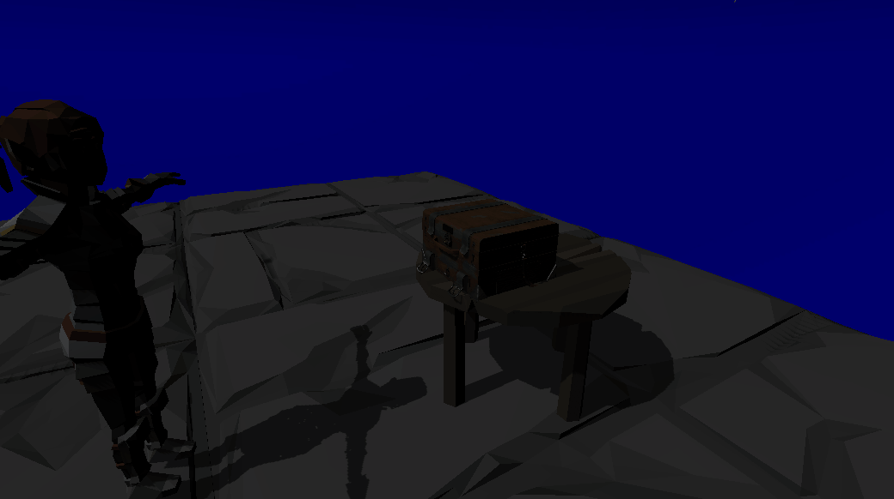
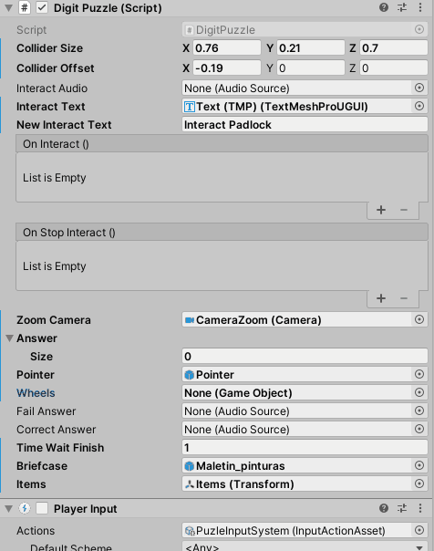

# Padlock

:jigsaw: :lock: Puzzle that consists of entering the correct combination in the padlock to open the briefcase and access its contents :briefcase:

When the player enters the detection range of the lock, he will be able to interact with it. 
Unity's new inpus system has been used and is configured to accept both controller and keyboard.

  

It has been implemented to accept any size of padlock. Through the inspector we indicate the object that contains all the wheels of the padlock, and it will automatically update to indicate the correct value of each wheel.

  

:link: COPYRIGHT :link:

All the scripts in this repository have been created by me (Except interaction system and interactable object that have been created by Juan Solana) and should not be used for commercial or personal projects without permission and without attribution.

The briefcase model was created by Juan Camilo Gómez and the padlock model by Antonio García Sánchez     
:point_right: https://www.artstation.com/vivibb :point_left:

:bangbang:THE MODELS OF THE BRIEFCASE AND THE PADLOCK CANNOT BE USED WITHOUT THE CONSENT OF THE ARTISTS:bangbang:
